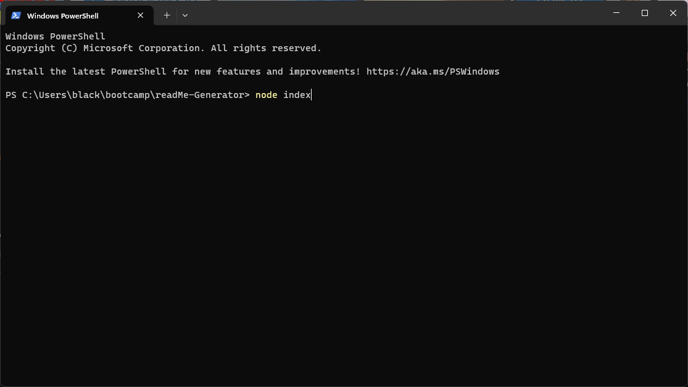
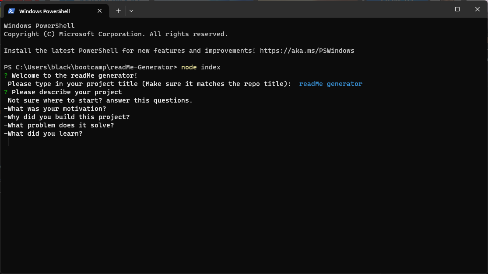
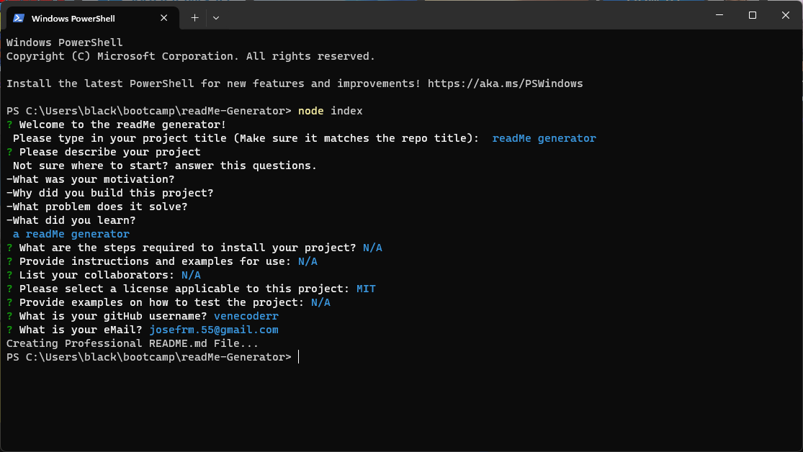

# readMe Generator

## Description
I wanted to test my knowledge on NodeJS and make my life as a developer easier at the same time so I built this app that takes the input for your readMe sections and builds up the file for you, it includes all of the elements of a high quality readMe

## Table of Contents
- [Installation](#installation)
- [Usage](#usage)
- [Questions](#questions)
- [Credits](#credits)

## Installation

The app doesn't require installation, but you'll need to download inquirer, for that:

Use the 'npm init -y' command to initialize NPM
Use 'npm i inquirer@8.2.4' to install inquirer (make sure to download version 8.2.4)

## Usage

Use the command 'node index.js' to run the app

Fill up the differente sections for your readMe

Choose a license and input your contact information, then wait and let the magic happen, you'll find your readMe in the 'generated' folder

## Credits

Thanks to James Hibbard for the sleep function snippet
https://www.sitepoint.com/delay-sleep-pause-wait/

## Tests
N/A

## Questions

For questions contact me at [Github](https://github.com/venecoderr) or [Email me](mailto:josefrm.55@gmail.com)

## Video demo

https://watch.screencastify.com/v/rrgL8yb6QY7SbbM9i0Od
